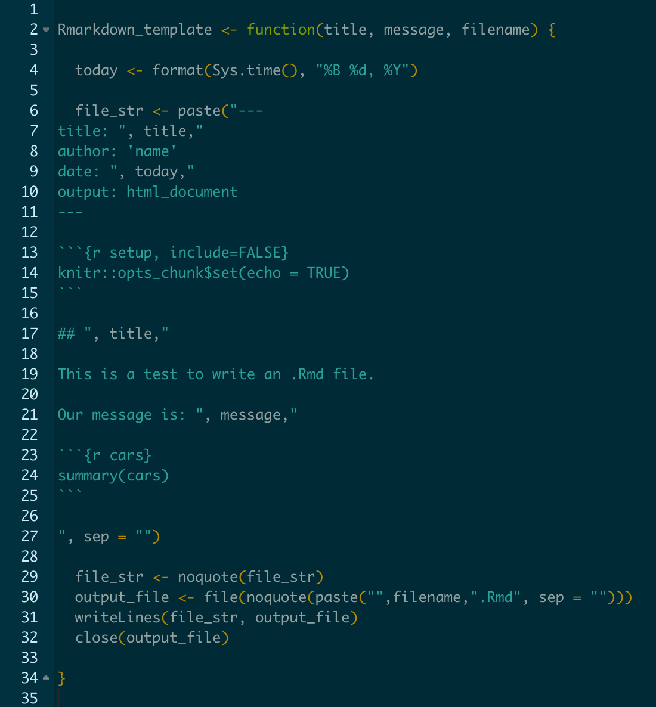

```{r setup1, include=FALSE}
knitr::opts_chunk$set(echo = TRUE)
```

## Programmatic Markdown

Here is an example of automating reporting using Markdown templates. 

* When making many models or doing some similar iterative task it's nice to be able to write the results to an individual RMarkdown / HTML rather than reporting them all in one place. Especially if there are more than handful of instances being reported on.

* Wrapping an Rmarkdown report in a function is a convenient way to create a reusable template.

  * It makes the reporting more accessible and has a cleaner, less cluttered appearance. 
  
  * It also reduces the risk of manual errors when creating different reports. 

* The Rmarkdown_template.R defines the function Rmarkdown_template. It is a basic example that uses the mtcars data set.

```{r Rmarkdown_template, eval = FALSE}

# load the function
source("Rmarkdown_template.R")

Rmd_to_render <- c('A Multiple Regression on MPG', 'Regress am on mpg')
models        <- c('fit_all<-lm(mpg~.,data=input)', 'lm(mpg~am,data=input)')
messages      <- c("First we regress all other variales on mpg.", 'Now regress AM on MPG') 
num           <- 1

for (file in Rmd_to_render) {
  
  Rmarkdown_template(title   = Rmd_to_render[num],
                    message  = messages[num], 
                    model    = models[num],
                    filename = file)

  rmarkdown::render(input       = paste0(file, '.Rmd'),
                    output_file = paste0(file, '.html'))
 
 num <- num + 1 
  
}
```

## The Rmarkdown_template() Function

* The Rmarkdown_template() is shown below as a picture because it's RMarkdown syntax limit the ability to show the actual text within this Rmarkdown document. 

* In a real world scenario, the contents migth relate to different products or marketing campaigns. Or diagostic reprting for different models being fit on a data set. 



